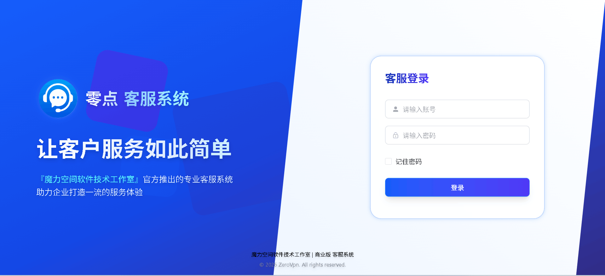
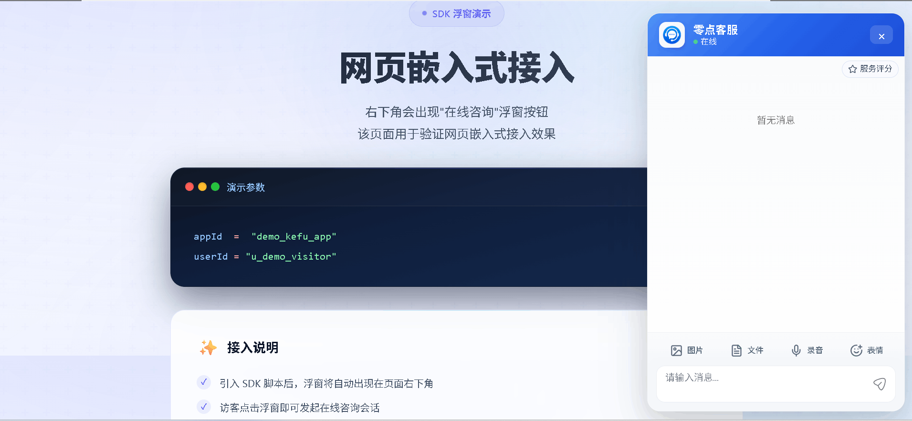
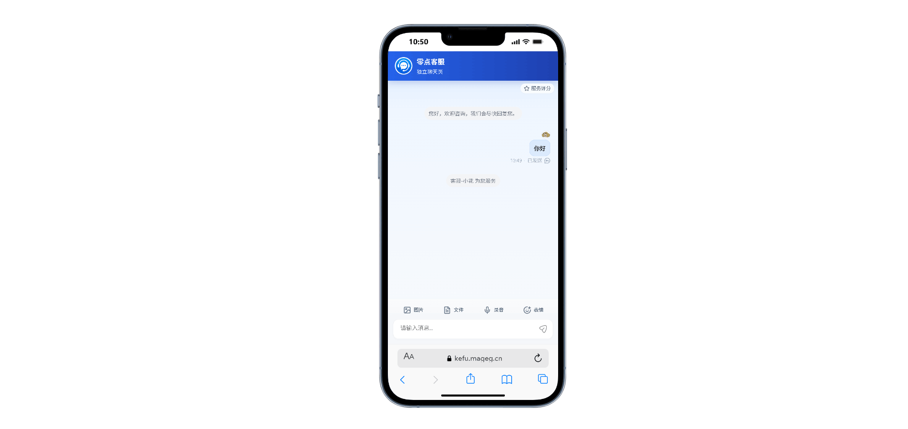
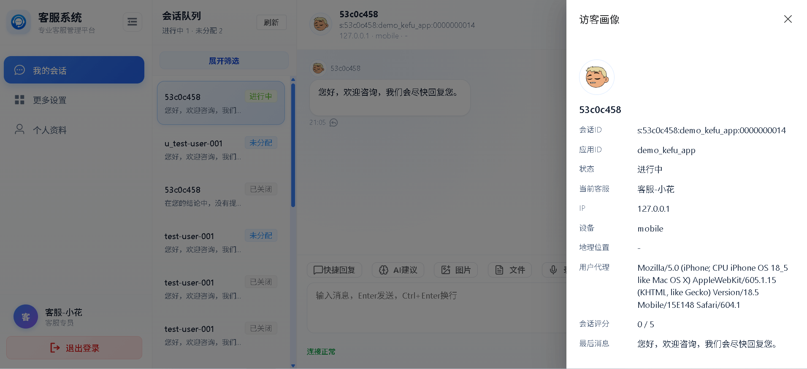
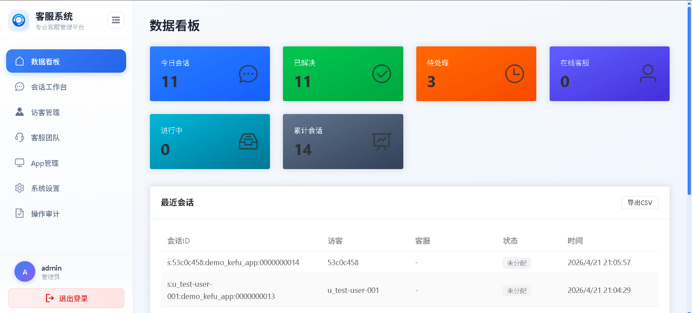
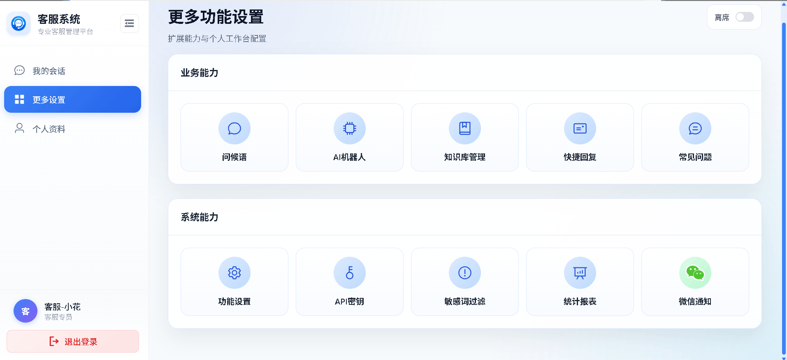

# kefu

个人客服系统（单二进制发布）：后端服务 + 管理后台 + 客服后台 + 网页 SDK。

## 目录
- `server`: Go 服务端（API + WS + 内嵌静态资源）
- `web-admin`: 管理/客服后台前端
- `web-sdk`: 网页接入 SDK 与独立聊天页
- `docs`: PRD、实施清单与运维文档

## 快速开始
1. 构建前端：
```bash
cd web-admin && npm install && npm run build
cd ../web-sdk && npm install && npm run build
```
2. 同步静态资源到服务端内嵌目录：
```bash
cd /mnt/d/work/kefugo
mkdir -p server/web/admin server/web/sdk
rsync -a --delete web-admin/dist/ server/web/admin/
rsync -a --delete web-sdk/dist/ server/web/sdk/
```
3. 启动服务：
```bash
cd server
CGO_ENABLED=0 go run .
```

说明：
- 推荐使用 `go run .`，会编译当前包全部文件，最不容易踩坑。

可选参数：
- `-addr`：监听地址（默认 `0.0.0.0:5300`）
- `-data`：数据目录（包含 SQLite、Badger、uploads）
- `-log-level`：日志级别（`trace|debug|info|warn|error|fatal|panic`）
- `-jwt-secret`：JWT 密钥（可选；未指定时使用内置默认值）

向量检索说明（单二进制）：
- 主数据库与向量索引统一存储在 SQLite（`modernc.org/sqlite` 驱动）。
- 当前向量层为可替换胶水层 `VectorStore`，默认后端 `SQLiteVecStore`。
- 若运行环境不支持 `sqlite-vec` 虚表能力，知识库会进入降级检索模式：
  - `/api/v1/knowledge-bases/healthz` 返回 `200`，`status=degraded`，便于前端显示“未就绪/降级中”而不是直接报服务宕机。
  - 文档入库、删除、基础检索仍可工作；检索会回退到基于本地文本特征的近似匹配。
- 推荐以 `CGO_ENABLED=0` 构建/运行，避免跨平台 `cgo` 依赖。

`-data` 未指定时默认路径：
- Windows：`%APPDATA%\kefu\`
- macOS：`~/Library/Application Support/kefu/`
- Linux：`~/.kefu/`

## WebView 支持说明（H5 / App）
- SDK 已支持标准 `WebSocket`、文件上传与文本消息，适配常见 H5 容器。
- 语音消息依赖 `MediaRecorder` 与 `getUserMedia`，部分低版本 WebView 不支持，建议在 App 内核中确认能力。
- 推荐在 WebView 中放开以下能力：
1. `https/wss` 网络访问
2. 媒体录音权限（麦克风）
3. 文件选择与上传

## SDK 接入

### 访客 ID 规则
- `userId` / `visitorId` 由业务方显式传入时，SDK 会优先使用该值。
- 未传时，SDK 会在当前浏览器本地自动生成匿名访客 ID，并持久化到 `localStorage + cookie`。
- 因此同一台机器上的同一浏览器、同一站点域名下，刷新页面后仍会复用同一个匿名访客 ID，不会每次刷新生成一个新会话。
- 业务用户统一规范为 `u_` 前缀，如 `u_10086`。
- SDK 匿名访客统一规范为 `v_` 前缀，如 `v_xxx`。
- 如果业务方传入 `10086`，SDK 会自动规范为 `u_10086`。
- 建议业务侧只传干净 ID：`[A-Za-z0-9_-]`。

### 网页浮窗接入 `widget.min.js`

#### 1. 匿名访客模式
适合官网、落地页、无需登录即可咨询的场景。

```html
<script
  type="module"
  src="http://<server-host>:5300/sdk/widget.min.js"
  data-kefu-appid="your-app-id"
  data-kefu-api-base-url="http://<server-host>:5300"
></script>
```

说明：
- 不传 `data-kefu-user-id` 时，SDK 自动生成并持久化匿名访客 ID。
- 同一浏览器刷新页面后仍是同一个访客。

#### 2. 固定业务用户模式
适合你已经有登录态，且希望客服会话直接绑定业务用户账号。

```html
<script
  type="module"
  src="http://<server-host>:5300/sdk/widget.min.js"
  data-kefu-appid="your-app-id"
  data-kefu-api-base-url="http://<server-host>:5300"
  data-kefu-user-id="u_10086"
></script>
```

也支持：
- `data-kefu-visitor-id="u_10086"`

#### 3. 动态获取业务用户 ID 后再初始化
适合用户信息需要异步请求、从 Token 解码、或等待宿主页面登录完成后再拿到的场景。

```html
<script
  type="module"
  src="http://<server-host>:5300/sdk/widget.min.js"
  data-kefu-sdk
></script>

<script type="module">
  const currentUser = await fetchCurrentUser();

  window.KefuChat.init({
    appId: "your-app-id",
    userId: currentUser.id, // 也可传 visitorId
    apiBaseUrl: "http://<server-host>:5300",
  });
</script>
```

说明：
- 这种模式下，不要同时再配 `data-kefu-appid` 自动初始化。
- 正确顺序是：先拿到业务用户 ID，再执行 `window.KefuChat.init(...)`。
- 否则会先以匿名访客建会话，后面再切业务用户，造成会话分裂。

### 全屏聊天页接入 `chat.html`
适合 App、H5、WebView、站内单独客服页。

#### 1. 直接拼接 URL

推荐地址：
```text
http://<server-host>:5300/sdk/chat.html?appId=demo_kefu_app&userId=u_10086
```

匿名访客模式：
```text
http://<server-host>:5300/sdk/chat.html?appId=demo_kefu_app
```

本地调试地址：
```text
http://127.0.0.1:5500/web-sdk/chat.html?appId=demo_kefu_app&apiBaseUrl=http://127.0.0.1:5300
```

参数说明：
- `appId`：必填，客服应用 ID。
- `userId`：选填，业务用户 ID。
- `visitorId`：选填，`userId` 的别名。
- `apiBaseUrl`：选填，默认同源；跨域调试时建议显式传入。
- `wsUrl`：选填，默认根据 `apiBaseUrl` 自动推导。

说明：
- `chat.html` 未传 `userId/visitorId` 时，也会自动复用浏览器本地匿名访客 ID。
- 如果 App / H5 已有登录用户，建议始终传稳定业务用户 ID。

#### 2. App / WebView 动态拼接

```js
const user = await getLoginUser();
const url =
  "http://<server-host>:5300/sdk/chat.html" +
  "?appId=your-app-id" +
  "&userId=" + encodeURIComponent(user.id) +
  "&apiBaseUrl=" + encodeURIComponent("http://<server-host>:5300");

webview.loadURL(url);
```

常见问题：
- 页面空白 + `chat.min.js 404` / `style.css MIME text/html`：
  - 原因：打开了源码页但静态资源路径不匹配。
  - 处理：优先使用 `/sdk/chat.html`；本地调试请确认 `web-sdk/dist/` 已构建并可访问。

## 主要访问地址
- 管理后台：`/admin`
- SDK 资源：`/sdk/widget.min.js`、`/sdk/chat.min.js`
- 健康检查：`/healthz`
- 知识库向量状态：`/api/v1/knowledge-bases/healthz`

## 产品截图
> 文档中使用缩略宽度展示，点击图片可查看原图。

### 登录页
<a href="./snapshot/login.png" target="_blank">
  
</a>

### SDK 浮窗
<a href="./snapshot/float.png" target="_blank">
  
</a>

### SDK 全屏 H5
<a href="./snapshot/h5.png" target="_blank">
  
</a>

### 客服工作台
<a href="./snapshot/agent.png" target="_blank">
  
</a>

### 管理后台
<a href="./snapshot/admin.png" target="_blank">
  
</a>

### 系统设置
<a href="./snapshot/setting.png" target="_blank">
  
</a>

## 更多文档
- [PRD](./docs/PRD.md)
- [运维手册](./docs/Operations.md)

## 最小示例

匿名浮窗：
```html
<script
  type="module"
  src="http://<server-host>:5300/sdk/widget.min.js"
  data-kefu-appid="your-app-id"
  data-kefu-api-base-url="http://<server-host>:5300"
></script>
```

业务用户浮窗：
```html
<script
  type="module"
  src="http://<server-host>:5300/sdk/widget.min.js"
  data-kefu-appid="your-app-id"
  data-kefu-api-base-url="http://<server-host>:5300"
  data-kefu-user-id="u_10086"
></script>
```

全屏聊天页：
```text
http://<server-host>:5300/sdk/chat.html?appId=your-app-id&userId=u_10086
```
